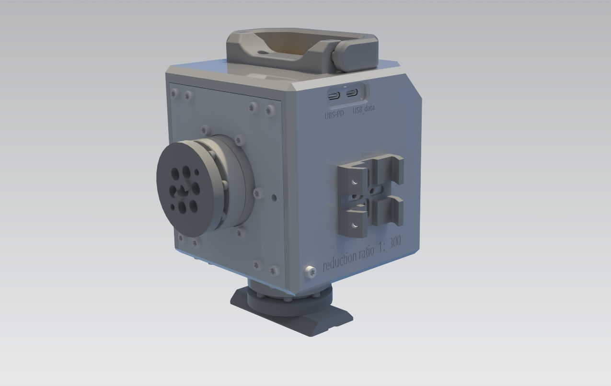
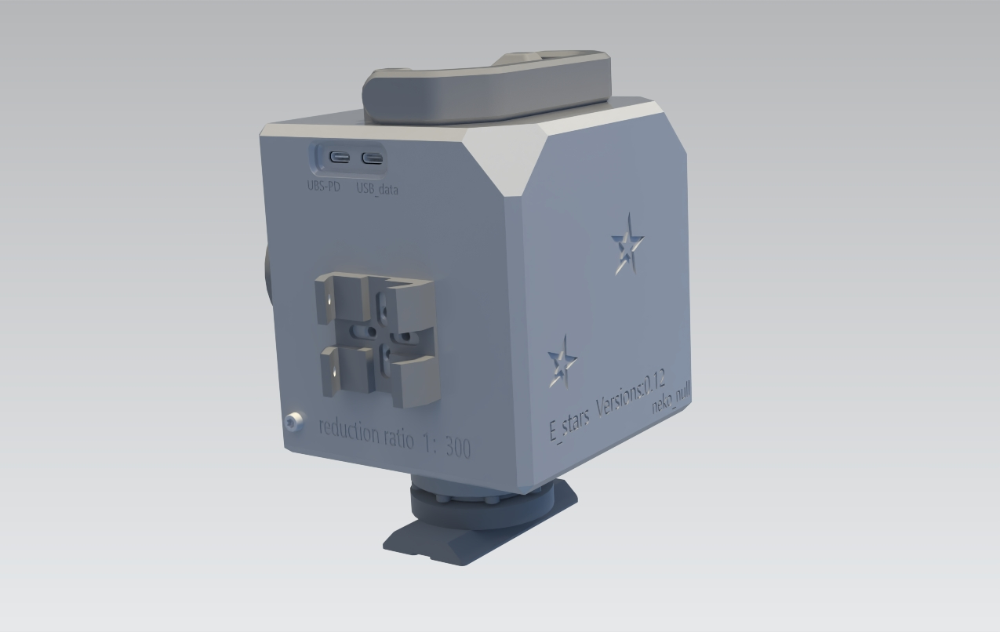

# E_start_harmonic_mount

[English](README.md) | **Simplified Chinese**

> ⚠️ **Project Status: Early development / Initial validation completed.**
>
> The hardware has been built and passed basic testing, but some details may still be optimized. Detailed assembly documentation, technical documentation, and drawings are still under preparation. Contributions and suggestions are welcome.

## Introduction

E_start is a compact harmonic-drive equatorial mount designed primarily for lightweight astrophotography and portable observation scenarios.

Design goals:

- Low cost: hybrid CNC + 3D-printed manufacturing, BOM controlled within 1500 CNY
- Compact: main frame dimensions 119 × 120 × 113 mm
- High reduction ratio: 1:300, suitable for high-precision stepper motor tracking
- Easy power supply: supports USB PD power, suitable for outdoor use

> Note: Full payload and guiding accuracy tests have not been completed at this stage. Related data will be added later.

## Hardware Components

- Uses S14 harmonic reducers + synchronous belt reduction mechanism, total reduction ratio 1:300
- RA axis equipped with an electromagnetic brake that locks automatically when power is lost to prevent accidental rotation
- 2 × 17HM15-0904S stepper motors (NEMA17, 42mm)
- Compact ESP32 control board designed specifically for this project

## Software & Features

- Firmware: OnStepX
- Power supply: supports USB PD protocol, automatic voltage negotiation, defaults to 12V, PD profile adjustable via web interface

## Current Status

- [x] Initial hardware build and validation
- [ ] OnStepX firmware and user documentation
- [ ] Detailed assembly instructions
- [ ] Technical drawings
- [ ] BOM
- [ ] Wiring diagram
- [ ] Complete documentation

## Safety Notes

- Keep hands away from moving parts during testing
- The RA axis electromagnetic brake may release after power loss; prevent the telescope from rotating unexpectedly
- When using USB PD power, ensure the power source has sufficient wattage and the cable is reliable
- For outdoor use, protect against water and dust

## Contributing

Issues, pull requests, and design suggestions are welcome.  
For questions, please use GitHub Issues first.

## Quick Links

- [Assembly instructions](docs/assembly.md)
- [Technical notes](docs/technical.md)
- [BOM](docs/bom.xlsx)
- [English](README.md)

## License

This project is released under the [GPL-3.0](LICENSE) license.

> Disclaimer: This design and documentation are provided "as is" without any warranty, express or implied. Users assume all risks associated with manufacturing, use, modification, and testing.
